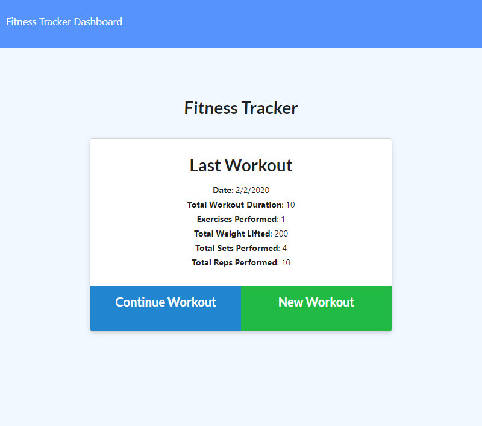

# Fitness Tracker

## Introduction

Keep track of your workout exercises and visualize them your progression with a personalized fitness dashboard.

This app runs on `express` and `mongoose` Node.js modules.

[Live Demo](https://mighty-oasis-39531.herokuapp.com/)

## Installation

**Node.js v13+** and **MongoDB 4.2.2+** are required in order to run this script.

1. Download or clone this repository into your local computer.
2. In your terminal, browse to the folder and run `npm install --production`.

## Usage

1. In your terminal, run the script with the command `npm start` or `node server.js`. This will run a local server that hosts the web app on port 3000.
2. Visit `http://localhost:3000` to access the web app.
3. Add a workout where you can add multiple exercises after another.
4. Click the `Complete` button to finalize the workout.
5. Click `Continue Workout` to add more exercises to the last workout.

## Preview

